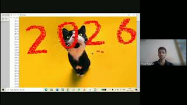

<h1 align="left"> Piyush Agrawal </h1>

#### DOB : 
26-12-2002

#### Education:
- Metric : Passed in 2018 with 88.83% from Indian Cambridge School, Jaipur
- High School : Passed in 2020 with 87.40% from Indian Cambridge School, Jaipur
- Graduation : Pursuing B.Tech. in Electronics and Comuunication Engineering from IIIT Kota

#### Skills:
- Proficient in HTML and CSS
- Expert in Machine Learning and Artificial Intelligence
- Command over Data Science and Programming

#### Projects:
##### Project 1 : Distance sensor & buzzer with RGB LED and Arduino UNO on Tinkercad

##### Project 2 : Chat GUI 'Sandes' through socket programming in Python

##### Project 3 : Coordinates display on clicking image and sketching line b/w max distance points

##### Project 4 : Gaming arena in Python with 4 playable games

### Reach me at:
1. [Instagram](https://instagram.com/_piyush_268)
2. [Github](https://github.com/cacklouncle)
3. [Mail to](mailto:agrawalpiyushjpr8@gmail.com)
